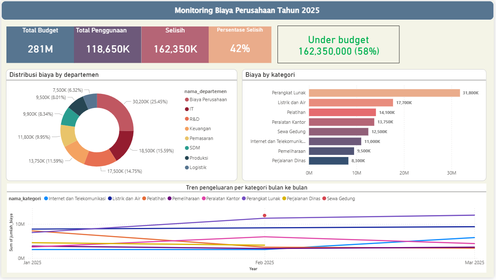

# 🚀 Monitoring Biaya Perusahaan - ETL & Dashboard

Proyek ini bertujuan untuk membangun proses ETL (Extract, Transform, Load) dan dashboard interaktif untuk memantau penggunaan biaya perusahaan berdasarkan departemen dan kategori pada tahun 2025. Proyek ini dikembangkan menggunakan Pentaho Data Integration (PDI) untuk proses ETL dan Power BI untuk visualisasi data.

----

🔄 Alur ETL

# Visualization

# 📁 Struktur Folder

    .
    ├── docs/                        # Dokumentasi visual proyek
    │   ├── Dashboard-PBI.png        # Tampilan dashboard Power BI
    │   ├── model-data.pdf           # Diagram model data
    │   └── proses_etl.png           # Diagram alur ETL
    ├── kettle/                      # Folder berisi file Kettle (ETL)
    │   ├── Etl_monitoring_biaya.kjb # Job utama ETL
    │   ├── job/                     # (opsional) Sub-job lainnya
    │   ├── setVariable_timestamp.ktr
    │   ├── setbudget.ktr
    │   ├── staging_area.ktr
    │   ├── transaksi_load.ktr
    │   └── transform.ktr
    ├── LICENSE
    └── README.md

# 📁 Sumber Data

    Budget            : Berasal dari file Excel berisi alokasi budget per departemen dan kategori.
    
    Transaksi Biaya   : Data transaksi real yang direkam harian/bulanan.
    
    Dimensi Pendukung : Tabel referensi untuk dim_waktu, dim_kategori, dim_departemen.

## 🌟 Tentang Saya

Halo! Saya **Afrijal Rasya Putra**, seorang **mahasiswa Informatika** yang sedang tertarik mendalami dunia **Data**. Meskipun masih di awal perjalanan kuliah, saya sangat antusias belajar tentang bagaimana data diproses dan diubah menjadi informasi yang bermakna.

📌 Saat ini saya sedang belajar:
- Data Visualization
- **SQL** dan dasar-dasar manipulasi data
- Konsep dasar **ETL** dan alur kerja data pipeline

Saya senang belajar dan mengeksplorasi hal-hal baru, terutama yang berkaitan dengan data. Saat ini saya sedang membangun keterampilan secara bertahap dan terus mencari peluang untuk berkembang. Saya juga terbuka untuk **magang** atau **proyek kolaboratif** yang bisa memberi saya pengalaman langsung dan membantu proses belajar saya.

📫 Jangan ragu untuk terhubung atau berdiskusi—saya senang bisa belajar dan berkembang bersama!

    
