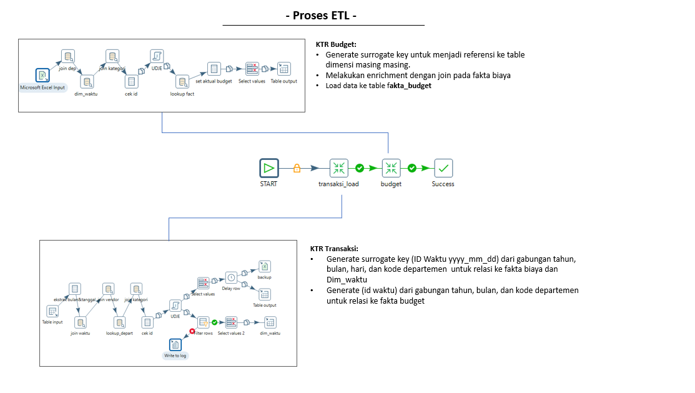

# 🚀 Monitoring Biaya Perusahaan - ETL & Dashboard 📊

Proyek ini bertujuan untuk membangun proses ETL (Extract, Transform, Load) dan dashboard interaktif untuk memantau penggunaan biaya perusahaan berdasarkan departemen dan kategori pada tahun 2025. Proyek ini dikembangkan menggunakan Pentaho Data Integration (PDI) untuk proses ETL dan Power BI untuk visualisasi data.

--

🔄 Alur ETL

# Struktur Folder
  .
  ├── docs/                        # Dokumentasi visual proyek
  │   ├── Dashboard-PBI.png        # Tampilan dashboard Power BI
  │   ├── model-data.pdf           # Diagram model data
  │   └── proses_etl.png           # Diagram alur ETL
  ├── kettle/                      # Folder berisi file Kettle (ETL)
  │   ├── Etl_monitoring_biaya.kjb # Job utama ETL
  │   ├── job/                     # (opsional) Sub-job lainnya
  │   ├── setVariable_timestamp.ktr
  │   ├── setbudget.ktr
  │   ├── staging_area.ktr
  │   ├── transaksi_load.ktr
  │   └── transform.ktr
  ├── LICENSE
  └── README.md

📁 Sumber Data
Anggaran Biaya: Berasal dari file Excel berisi alokasi budget per departemen dan kategori.

Transaksi Biaya: Data transaksi real yang direkam harian/bulanan.

Dimensi Pendukung: Tabel referensi untuk dim_waktu, dim_kategori, dim_departemen.
